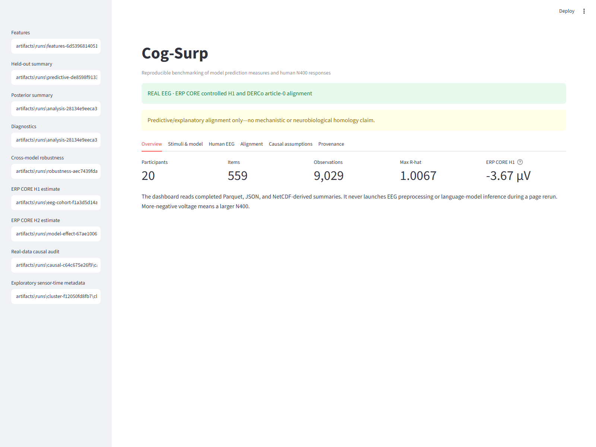
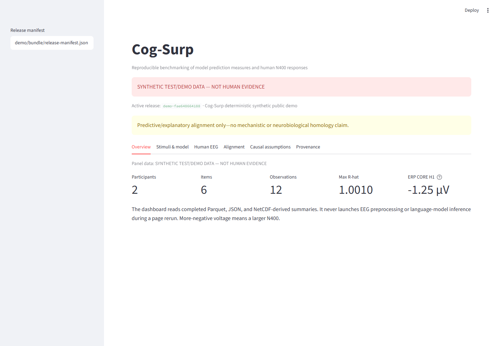
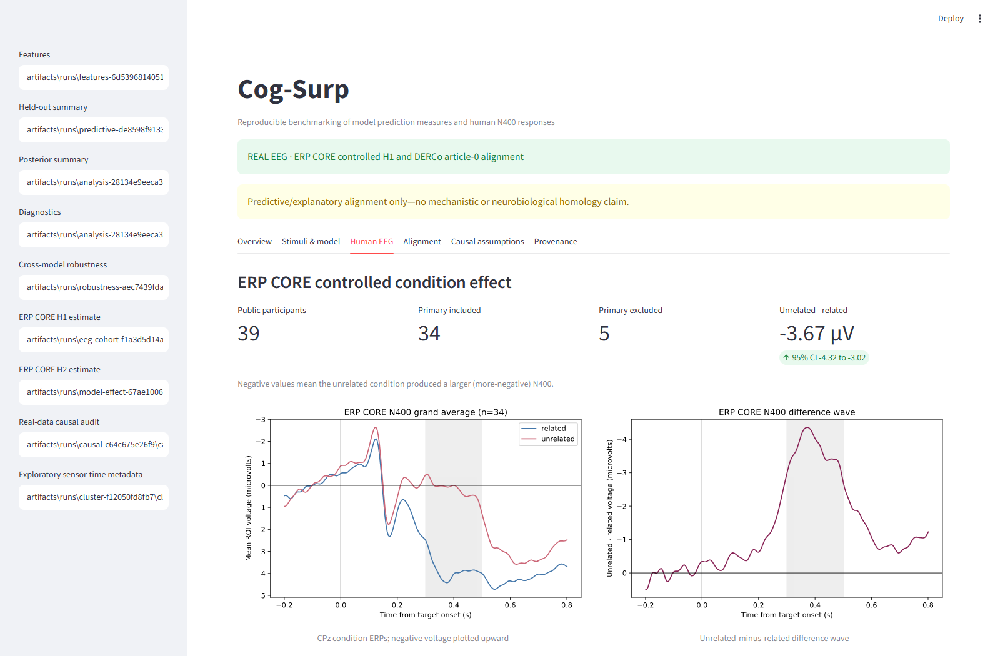
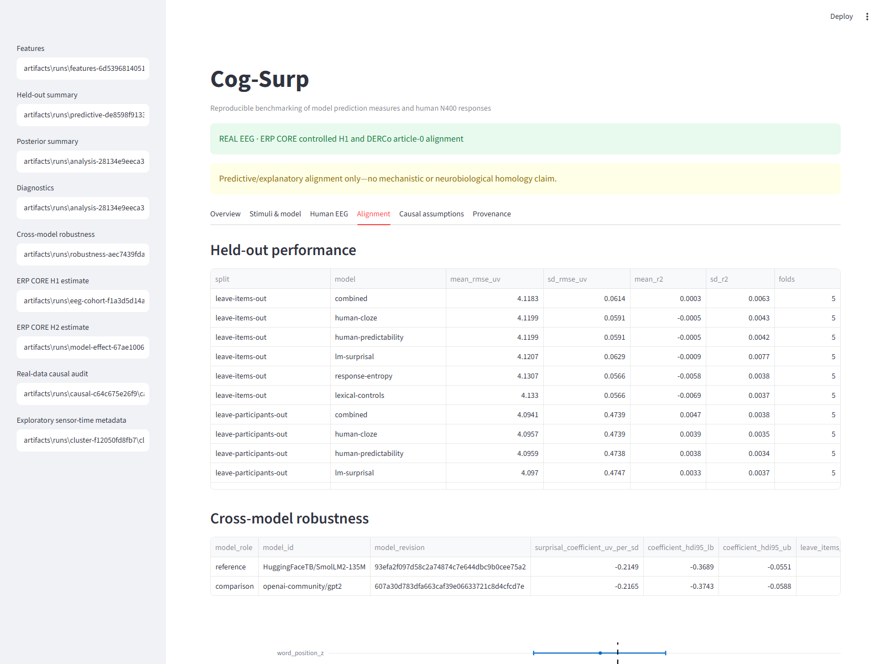
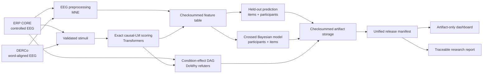

<div align="center">

# Cog-Surp

### Language-model prediction measures × human N400 responses

**A reproducible research workbench for controlled ERP effects, exact
causal-LM scoring, naturalistic EEG alignment, and explicit causal auditing.**

[](https://github.com/salehestaki/cog-surp/actions/workflows/ci.yml)
[](https://www.python.org/)
[](LICENSE)
[](docs/scientific_scope.md)
[](docs/reproducibility.md)
[](docs/scientific_scope.md)

[Quick start](#quick-start) ·
[Results](#results-at-a-glance) ·
[Dashboard](#research-dashboard) ·
[Architecture](#architecture) ·
[Documentation](#documentation)

</div>



> [!IMPORTANT]
> Cog-Surp measures **experimental effects**, **model behavior**, and
> **predictive/explanatory alignment** as three separate questions. Alignment
> does not establish that a language model and the human brain implement the
> same mechanism.

## Two ways to inspect the project

### Quick demo — synthetic, no human evidence

The committed CPU-only demo loads immediately, needs no downloads, and is
visibly marked **SYNTHETIC TEST/DEMO DATA — NOT HUMAN EVIDENCE** in every
dashboard section:

```bash
uv sync --locked --extra all
uv run cog-surp demo build
uv run cog-surp app run --manifest demo/bundle/release-manifest.json
```



### Full empirical pipeline — public EEG and model downloads required

The verified findings and screenshots below come from checksummed real ERP
CORE and DERCo runs. Raw EEG, model weights, and DERCo derivatives are not
redistributed. Follow the [reproduction commands](#reproducible-pipelines)
after reviewing dataset terms and local compute requirements.

## What Cog-Surp answers

| Question | Estimand | Evidence |
|---|---|---|
| **H1 · Human response** | Does a controlled semantic manipulation change N400-window voltage? | Real ERP CORE EEG |
| **H2 · Model response** | Does the same manipulation change word-region surprisal? | Exact teacher-forced scores from three pinned causal LMs |
| **H3 · EEG alignment** | Does LM surprisal explain held-out EEG variation beyond human and lexical controls? | Real DERCo word-aligned EEG |
| **H4 · Alternatives** | How do human cloze probability and response entropy compare with raw LM surprisal? | Leakage-resistant item and participant holdouts |
| **H5 · Robustness** | Are conclusions stable across models, tokenization strategies, participants, items, and preprocessing choices? | Model, strategy, cohort, and exploratory sensor-time audits |

## Results at a glance

| Analysis | Current result | Interpretation |
|---|---:|---|
| **ERP CORE H1** | **−3.669 µV**, 95% CI [−4.319, −3.019], 34/39 participants | Unrelated targets produced a larger, more-negative N400 |
| **SmolLM2-135M H2** | **+3.057 nats**, 95% CI [2.355, 3.759] | Unrelated primes increased target surprisal |
| **GPT-2 H2** | **+1.628 nats**, 95% CI [1.127, 2.129] | Directionally consistent model response |
| **Qwen2.5-0.5B H2** | **+3.517 nats**, 95% CI [2.606, 4.428] | Third-family, larger-scale controlled robustness check |
| **DERCo H3** | **−0.215 µV/SD**, 95% HDI [−0.369, −0.055] | Conditional association; not a causal LM→EEG effect |
| **Held-out gain** | ≈ **0.015 µV RMSE**; mean R² near zero | Statistically visible association, weak practical prediction |

The full-article H3 comparison currently covers SmolLM2 and GPT-2. Qwen is a
controlled H2 robustness result only. See
[limitations](docs/limitations.md) for the complete interpretation boundary.

## Research dashboard

The Streamlit interface validates one immutable release manifest and reads
only the completed, checksummed artifacts named there. It never discovers
"latest" files, combines unrelated runs, or runs EEG preprocessing/model
inference during a page rerun.

### Real ERP waveforms and prespecified N400 effect



### Held-out prediction and cross-model robustness



The dashboard also includes stimulus/model inspection, causal assumptions,
participant QC, exploratory sensor-time statistics, and complete provenance.

```bash
uv run cog-surp app run --manifest demo/bundle/release-manifest.json
```

## Why this workbench is different

- **Real EEG is the evidential foundation.** Synthetic EEG is restricted to
  tests, recovery studies, demonstrations, and power analysis.
- **Probabilities are exact and auditable.** Scientific scoring uses
  teacher-forced causal logits, correct next-token shifting, `log_softmax`,
  observed-token gathering, and explicit token-to-word aggregation.
- **Leakage is controlled.** Predictive evaluation separates both participants
  and items.
- **Causal language is constrained by design.** The DAG permits condition→EEG
  and condition→model-measure effects, but no default
  model-surprisal→human-EEG edge.
- **Every stage is traceable.** Resolved configurations, immutable run IDs,
  parent hashes, artifact checksums, model revisions, exclusions, and runtime
  provenance travel with the result.
- **The dashboard is a reader, not an analysis notebook.** Scientific logic
  lives in the typed package and deterministic CLI.

## Architecture



Cog-Surp is a modular monolith with ports-and-adapters boundaries:

```text
datasets → stimuli / EEG / LM → features → analysis / causal
                                    ↓
                         provenance / reporting / dashboard
```

## Quick start

### 1. Install

Install [uv](https://docs.astral.sh/uv/), then create the locked environment:

```bash
git clone https://github.com/salehestaki/cog-surp.git
cd cog-surp
uv sync --locked --extra all
```

### 2. Verify

```bash
uv run cog-surp doctor
uv run pytest
uv run cog-surp demo build
uv run cog-surp report validate-manifest \
  --manifest demo/bundle/release-manifest.json
```

### 3. Explore the CLI

```bash
uv run cog-surp --help
uv run cog-surp datasets list
```

> [!NOTE]
> Public EEG data and model weights are intentionally not stored in Git.
> Dataset fetches and model downloads retain their original licenses and are
> materialized locally with checksummed manifests.

## Reproducible pipelines

<details>
<summary><strong>DERCo · naturalistic word-level EEG alignment</strong></summary>

```bash
uv run cog-surp datasets fetch derco --subject LRK01 --run article_0

uv run cog-surp stimuli validate \
  --config configs/datasets/derco.yaml

uv run cog-surp eeg preprocess \
  --config configs/eeg/derco.yaml \
  --subject LRK01 \
  --article article_0

uv run cog-surp lm score \
  --config configs/models/model_matrix.yaml \
  --stimuli-path artifacts/runs/<stimulus-run>/stimuli.parquet

uv run cog-surp features build \
  --stimuli-path artifacts/runs/<stimulus-run>/stimuli.parquet \
  --surprisal-path artifacts/runs/<lm-run>/surprisal.parquet

uv run cog-surp analyze predictive \
  --features-path artifacts/runs/<feature-run>/features.parquet

uv run cog-surp analyze fit \
  --config configs/analyses/derco_primary.yaml \
  --features-path artifacts/runs/<feature-run>/features.parquet
```

</details>

<details>
<summary><strong>ERP CORE · controlled N400 cohort and matched model effect</strong></summary>

ERP CORE's public files do not contain an authoritative randomized
trial-to-word key. Cog-Surp therefore estimates human H1 and matched-stimulus
model H2 separately rather than fabricating item-level mediation.

```bash
uv run cog-surp eeg preprocess \
  --config configs/eeg/erp_core_primary.yaml \
  --subject 001 \
  --dataset-manifest artifacts/runs/<dataset-run>/dataset-manifest.json

uv run cog-surp eeg summarize-cohort \
  --config configs/eeg/erp_core_primary.yaml \
  --dataset-manifest artifacts/runs/<dataset-run>/dataset-manifest.json

uv run cog-surp analyze model-effect \
  --surprisal-path artifacts/runs/<erp-smollm-run>/surprisal.parquet \
  --surprisal-path artifacts/runs/<erp-gpt2-run>/surprisal.parquet \
  --surprisal-path artifacts/runs/<erp-qwen-run>/surprisal.parquet

uv run cog-surp analyze causal-condition \
  --h1-trials-path artifacts/runs/<cohort-run>/eeg/cohort/accepted-single-trial-n400.parquet \
  --h2-surprisal-path artifacts/runs/<erp-smollm-run>/surprisal.parquet \
  --h2-surprisal-path artifacts/runs/<erp-gpt2-run>/surprisal.parquet

uv run cog-surp eeg cluster-exploratory \
  --config configs/eeg/erp_core_cluster.yaml \
  --cohort-run artifacts/runs/<cohort-run>
```

</details>

<details>
<summary><strong>Controlled model-side stress-test stimuli</strong></summary>

```bash
uv run cog-surp stimuli generate-controlled \
  --config configs/stimuli/controlled.yaml
```

Generated candidates remain explicitly labeled as computational stress tests;
they are not treated as validated human experimental materials.

</details>

## Quality and reproducibility

The release gate runs:

```bash
uv run ruff format --check .
uv run ruff check .
uv run mypy
uv run pytest
uv run cog-surp doctor --json
```

Release validation covers 83 scientific, unit, integration, dashboard,
manifest-integrity, and reproducibility tests, with no skips or failures. The
package builds as both an sdist and wheel; both pass isolated installation,
and the base wheel passes the machine-readable doctor check.

## Documentation

| Document | Purpose |
|---|---|
| [Scientific scope](docs/scientific_scope.md) | Claims, estimands, confirmatory boundaries |
| [Current state](docs/current_state.md) | Completed runs, results, and validation status |
| [Data dictionary](docs/data_dictionary.md) | Treatment, outcome, predictor, and control roles |
| [Preprocessing](docs/preprocessing.md) | EEG pipeline and sign conventions |
| [Causal assumptions](docs/causal_assumptions.md) | DAG, identification, refuters, and non-claims |
| [Reproducibility](docs/reproducibility.md) | Cache behavior, manifests, containers, provenance |
| [Limitations](docs/limitations.md) | Dataset, model, licensing, and inference limits |
| [Research landscape](docs/research_landscape.md) | Adjacent platforms and technical choices |
| [Architecture decisions](docs/adr/) | Accepted scientific and engineering decisions |
| [v0.1.0 release notes](docs/release_notes_v0.1.0.md) | Release changes, migration, gates, limitations |
| [Release checklist](docs/release_checklist.md) | Evidence-backed verification status |

## Data and licensing

- **Source code:** Apache-2.0.
- **ERP CORE:** conflicting public declarations are handled conservatively as
  CC BY-SA 4.0.
- **DERCo:** the OSF dataset has no declared dataset license and is recorded as
  `NOASSERTION`; analyze locally and do not redistribute.
- **Model weights:** governed by their original model-card licenses and never
  committed to this repository.

## Citation

If Cog-Surp supports your work, use the metadata in [`CITATION.cff`](CITATION.cff).

Maintainer: [Saleh Estaki Organi](https://github.com/salehestaki) ·
[ORCID](https://orcid.org/0009-0002-0642-4384) ·
[LinkedIn](https://www.linkedin.com/in/saleh-estaki/)

---

<div align="center">

**Built for transparent comparison—not mechanistic overclaiming.**

</div>
