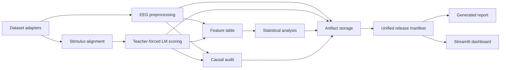

# Architecture

Cog-Surp is a typed modular monolith. The CLI is the reproducible orchestration
boundary; Streamlit reads completed artifacts only.

- `datasets`: immutable source acquisition, checksums, and dataset adapters.
- `stimuli`: publisher stimulus reconstruction and deterministic validation.
- `eeg`: dataset-specific preprocessing or extraction into single-trial
  outcomes.
- `lm`: exact teacher-forced causal-LM scoring and token/region strategies.
- `features`: authoritative item joins and computational/lexical features.
- `analysis`: grouped prediction, crossed Bayesian models, and robustness.
- `causal`: DAG representation and defensible experimental estimands.
- `provenance`: canonical JSON, checksums, code/runtime/package snapshots.
- `release`: coherent, self-contained, checksummed artifact bundles.
- `reporting` and `dashboard`: consumers of one validated release manifest.

The dashboard performs no EEG preprocessing, model inference, fitting, or
artifact discovery. It validates one manifest and reads only the files named
and checksummed there.

Raw data remain under ignored `data/raw`. Every transformation writes into a
content-derived `artifacts/runs/<run-id>` directory with resolved
configuration, parent hashes, output hashes, and real/synthetic status. A
release builder copies one compatible family into an immutable
`artifacts/releases/<release-id>` bundle; it does not select files by
modification time.
Dataset-specific decisions do not leak into model scoring or statistical
interfaces.

The architecture deliberately avoids services, queues, and databases while
the workload is local and research-oriented. ADR 0001 records that decision.
